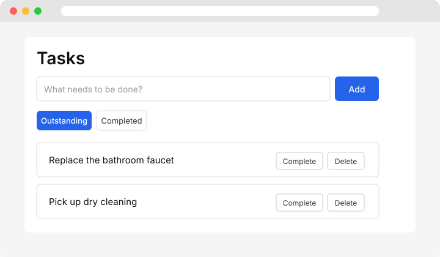

# Tasks

MCP-first personal task management.

[](https://github.com/ericbaukhages/tasks/actions/workflows/ci.yml)
[](https://ericbaukhages.github.io/tasks/)
[](./LICENSE)

A small, fast, agent-friendly task manager with three interfaces over a single shared core:

- **Web UI** — React + Vite
- **HTTP API** — Fastify
- **MCP server** — stdio Model Context Protocol server for AI assistants

All interfaces share the same application logic and SQLite persistence layer.



## Features

- Create, view, complete, and soft-delete tasks
- Toggle between outstanding and completed tasks in the web UI
- RESTful HTTP API with structured errors
- MCP server exposing `create_task`, `list_tasks`, `get_task`, `complete_task`, and `delete_task`
- SQLite persistence via Node.js built-in `node:sqlite` — no native modules to compile
- Clean domain/application/interface layering with comprehensive tests

## Quick start

### Requirements

- [Nix](https://nixos.org/download/) (recommended) **or** Node.js **22.13+**
- [just](https://github.com/casey/just) (optional)

### Install

With Nix:

```bash
nix develop
npm install
```

Without Nix:

```bash
npm install
```

### Build and test

```bash
just build
just test
just lint
```

Or directly with npm:

```bash
npm run build
npm run test
npm run lint
```

## Usage

### Web UI

Start the API and the Vite dev server in two terminals:

```bash
just serve        # npm run serve
just dev-web      # npm run dev --workspace=web
```

Open [http://localhost:5173](http://localhost:5173).

### HTTP API

The API runs on `http://localhost:3000`.

```bash
curl -X POST http://localhost:3000/api/tasks \
  -H 'Content-Type: application/json' \
  -d '{"description":"Buy groceries"}'

curl 'http://localhost:3000/api/tasks?status=pending'
```

See `server/src/http/api.ts` for all routes.

### MCP server

```bash
just mcp          # npm run mcp
```

The server reads and writes the same SQLite database as the HTTP API. When `DB_PATH` is not set, the database is created at `server/data/tasks.db` relative to the server module so the path is stable regardless of working directory.

#### Connect from an MCP client

```json
{
  "mcpServers": {
    "tasks": {
      "command": "node",
      "args": ["/path/to/repo/server/dist/mcp/server.js"]
    }
  }
}
```

Or inspect it with the MCP Inspector:

```bash
npx @modelcontextprotocol/inspector node server/dist/mcp/server.js
```

## Architecture

```text
                    Web UI  (React + Vite)
                       │
                       ▼
                  HTTP API  (Fastify)
                       │
                       ▼
               Application Core  (TaskService)
                  │         │
                  ▼         ▼
                Domain    Persistence  (SQLite via node:sqlite)
                            │
                            ▼
                          SQLite

              MCP Server  (stdio)
                       │
                       ▼
               Application Core  (same TaskService)
```

Responsibilities:

- **Domain** (`server/src/domain/task.ts`): task shape, statuses, and pure state transitions.
- **Application** (`server/src/application/task-service.ts`): use-case orchestration and repository interface.
- **Persistence** (`server/src/persistence/sqlite-task-repository.ts`): SQLite implementation using Node.js's built-in `node:sqlite`.
- **HTTP interface** (`server/src/http/`): Fastify routes with `zod` validation.
- **MCP interface** (`server/src/mcp/`): stdio MCP server with validated tools and structured responses.
- **Web interface** (`web/src/`): React UI that calls the HTTP API.

Neither the HTTP nor the MCP interface touches the database directly.

## Project site

Visit the project page at [https://ericbaukhages.github.io/tasks/](https://ericbaukhages.github.io/tasks/) for an overview, screenshots, and links.

## AI usage

AI-assisted development is encouraged for this MCP-first project. Attribution is included in commit messages that contain AI-generated or -assisted content. See [AGENTS.md](./AGENTS.md).

## License

MIT — see [LICENSE](./LICENSE).
